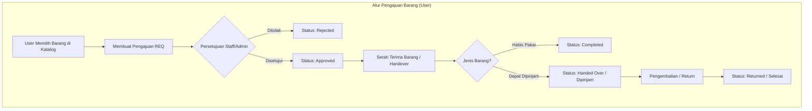

# SIMINV — Penjelasan Sistem & Arsitektur

Dokumen ini berisi penjelasan lengkap mengenai arsitektur, modul, alur bisnis, serta aturan keamanan pada **SIMINV (Sistem Informasi Inventaris)**.

---

## 1. Gambaran Umum Sistem

**SIMINV** adalah sistem informasi manajemen inventaris berbasis web yang dirancang untuk mengelola persediaan barang, transaksi barang masuk/keluar, serta alur pengajuan dan peminjaman barang oleh pegawai di suatu organisasi atau instansi.

Sistem ini memisahkan peran dan hak akses pengguna secara ketat menjadi 3 tingkat (Role-Based Access Control):
1. **Super Admin**: Memiliki akses penuh terhadap sistem (manajemen pengguna, master data, pengaturan sistem, log aktivitas, dan pembatalan transaksi).
2. **Staff (Gudang/Inventaris)**: Mengelola barang, memproses transaksi stok, memproses pengajuan/peminjaman (persetujuan, serah terima, pengembalian), serta mencetak laporan.
3. **User (Pegawai)**: Melihat katalog barang, mengajukan permintaan barang habis pakai atau peminjaman barang, serta memantau status pengajuan milik sendiri.

---

## 2. Arsitektur & Teknologi

Sistem dibangun dengan arsitektur decoupled (terpisah antara Frontend dan Backend):

```
SIMINV Application
├── Backend (Flask REST API)
│   ├── Framework: Python 3.10+ & Flask 3.0
│   ├── ORM & Database: SQLAlchemy 2.0 & PostgreSQL 16
│   ├── Autentikasi: Flask-JWT-Extended (JSON Web Token)
│   ├── Migrasi DB: Flask-Migrate & Alembic
│   └── Ekspor Laporan: OpenPyXL (Excel) & ReportLab (PDF)
│
└── Frontend (Single Page Application)
    ├── Framework: React 18 + Vite
    ├── Routing: React Router v6
    ├── HTTP Client: Axios (dengan Interceptor JWT Auto-Refresh)
    └── Visualisasi Data: Recharts
```

---

## 3. Peran Pengguna & Hak Akses (RBAC)

| Fitur / Modul | Super Admin | Staff Gudang | User (Pegawai) |
|---|:---:|:---:|:---:|
| Katalog & Pengajuan Barang | ✅ | ✅ | ✅ |
| Riwayat Pengajuan Sendiri | ✅ | ✅ | ✅ |
| Dashboard Pegawai | ✅ | ✅ | ✅ |
| Dashboard Ringkasan / Grafik Manajerial | ✅ | ✅ | ❌ |
| Proses Persetujuan & Serah Terima Pengajuan | ✅ | ✅ | ❌ |
| Transaksi Stok (Barang Masuk/Keluar/Opname) | ✅ | ✅ | ❌ |
| Manajemen Master Data (Kategori, Lokasi, dll) | ✅ | ✅ | ❌ |
| Manajemen Barang & Stok Minimum | ✅ | ✅ | ❌ |
| Laporan & Cetak PDF/Excel | ✅ | ✅ | ❌ |
| Pembatalan / Reversal Transaksi Stok | ✅ | ❌ | ❌ |
| Manajemen Pengguna (CRUD User & Reset Pass) | ✅ | ❌ | ❌ |
| Pengaturan Sistem & Log Aktivitas Audit | ✅ | ❌ | ❌ |

---

## 4. Modul & Fitur Utama

### A. Autentikasi & Keamanan
* **JWT Access & Refresh Token**: Access Token berlaku selama 60 menit, Refresh Token berlaku 7 hari dengan mekanisme auto-refresh di frontend.
* **Token Blocklist**: Token yang di-logout dicatat di database agar tidak bisa digunakan kembali.
* **Proteksi Bruteforce**: Akun terkunci otomatis selama 15 menit jika 5x berturut-turut gagal login.
* **Keamanan Password**: Password dienkripsi menggunakan algoritma `bcrypt`.

### B. Manajemen Barang & Master Data
* **Pengodean Otomatis**: Kode barang dibuat otomatis dengan format `BRG-0001`, `BRG-0002`, dst.
* **Tipe Barang**:
  * *Consumable* (Habis Pakai): Kertas, pulpen, tinta printer.
  * *Loanable* (Dapat Dipinjam): Laptop, proyektor, kabel extension.
* **Master Data**: Mengelola Kategori, Lokasi simpan/rak, Satuan barang, dan Supplier.
* **Safe Soft-Delete**: Master data dan barang yang pernah digunakan dalam transaksi tidak dihapus permanen, melainkan dinonaktifkan demi menjaga integritas riwayat histori.

### C. Transaksi Stok & Concurrency Control
Sistem mendukung 4 jenis transaksi stok utama:
1. **IN (Barang Masuk)**: Penambahan stok dari supplier.
2. **OUT (Barang Keluar)**: Pengurangan stok langsung untuk kebutuhan operasional.
3. **ADJUSTMENT (Stock Opname)**: Penyesuaian stok fisik dengan catatan sistem (wajib mencantumkan alasan).
4. **REVERSAL (Transaksi Pembalik)**: Pembatalan transaksi oleh Super Admin dengan mencatat transaksi penyeimbang.

> 🛡️ **Aturan Keamanan Stok**: Seluruh perubahan stok diproses melalui fungsi terpusat (`create_transaction`) yang menerapkan **Row Locking (`SELECT ... FOR UPDATE`)** dan Database Check Constraint (`stock >= 0`), sehingga stok **tidak akan pernah negatif** meskipun terjadi request bersamaan (*race condition*).

### D. Alur Pengajuan & Peminjaman (Request & Loan Flow)
* **Katalog & Keranjang**: Pegawai dapat memilih barang consumable atau loanable dan menambahkannya ke daftar pengajuan.
* **Status Pengajuan**: `pending` ➔ `approved` / `rejected` ➔ `handed_over` ➔ `returned` / `completed`.
* **Pengembalian Barang Pinjaman**: Pencatatan kondisi barang saat dikembalikan (`good` / `damaged` / `lost`).

### E. Laporan & Ekspor Data
Sistem menyediakan 4 jenis laporan interaktif dengan opsi pratinjau tabel serta ekspor dalam format **Excel (.xlsx)** dan **PDF**:
1. **Laporan Stok Barang** (Filter lokasi, kategori, & stok menipis).
2. **Laporan Riwayat Transaksi Stok** (Filter rentang tanggal & tipe transaksi).
3. **Laporan Pengajuan & Peminjaman** (Filter status & keterlambatan).
4. **Kartu Stok Barang** (Histori lengkap per pergerakan barang).

---

## 5. Alur Kerja Sistem (Workflows)



---

## 6. Standar Penomoran Dokumen (Auto Numbering)

Semua dokumen transaksi dan pengajuan menggunakan format nomor unik sistematis:

* **Pengajuan / Permintaan**: `REQ-YYYYMMDD-NNN` (Contoh: `REQ-20260928-001`)
* **Barang Masuk**: `IN-YYYYMMDD-NNN`
* **Barang Keluar**: `OUT-YYYYMMDD-NNN`
* **Penyesuaian (Opname)**: `ADJ-YYYYMMDD-NNN`
* **Pengembalian**: `RET-YYYYMMDD-NNN`
* **Transaksi Pembalik**: `REV-YYYYMMDD-NNN`
